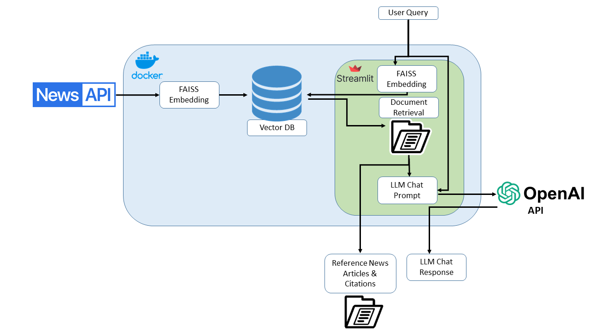

# AI COVID + Flu Analyst


This is a Streamlit app that leverages millions of news sources, up-to-date CDC data, an LLM RAG (Retrieval-Augmented Generation) architecture, and multiple forecasting methods to provide a monitoring dashboard for flu and COVID infections.

## Features

### 1. Descriptive & Predictive Infection Dashboard
- **Description**: Displays the latest infection data in the US from the CDC, combined with Census geo-spatial data.
- **Visualization**: Maps infections by total number and rate.
- **Forecasting**: ARIMA models forecast infection numbers, offering insight into bulk numbers by state and region.

### 2. Interactive AI News Analyst
- **Functionality**: Uses an LLM RAG deployment to allow users to interactively query the latest news on COVID and hospitalizations in the US and globally.

### 3. Forecasted Hospital Burden
- **Prediction**: Forecasts the impact on each state's hospital systems by predicting infections, hospitalization rates, and hospital capacity.
- **Insights**: Evaluates the burden of flu and COVID patients on hospital bed capacity and issues warnings for potential capacity concerns.

## Quick Start Guide

Follow these steps to set up and run the app on your local machine.

### Prerequisites
1. Install [Git](https://git-scm.com/book/en/v2/Getting-Started-Installing-Git).
2. Create an account on the [OpenAI Developer Platform](https://platform.openai.com/docs/overview).
3. Create a free account with [News API](https://newsapi.ai/).

### Setup
1. **Clone the Repository**:
    ```sh
    git clone https://github.com/yourusername/yourproject.git
    cd yourproject
    ```

2. **Update the API Keys**:
   - Add your OpenAI API Key to `oai_template.yaml` and rename the file to `oai.yaml`.
   - Add your News API Key to `newsapi_template.yaml` and rename the file to `newsapi.yaml`.

3. **Setup the Python Virtual Environment**:
    ```sh
    venv/Scripts/Activate
    ```

4. **Run the Streamlit App**:
    ```sh
    streamlit run ./src/streamlit/app.py
    ```

### Access the App
Once the server is running, open your browser and navigate to [http://localhost:8182](http://localhost:8182).

---
This section outlines the architecture and functionality of the implemented Retrieval-Augmented Generation (RAG) model, which integrates news data from NewsAPI, user query handling through Streamlit, and response generation using OpenAI's API.

Workflow Description
1. **Data Ingestion and Processing**
        Source: News articles are fetched from NewsAPI.
        Embedding: Articles are converted into vector representations using FAISS (Facebook AI Similarity Search) embeddings, which capture the semantic content of the articles for effective retrieval.
2. **Vector Database Storage**
        Storage: The embeddings are stored in a Vector Database optimized for fast and accurate similarity searches.
3. **User Query Interface**
        Interface: Users input queries via a Streamlit-based interface, designed for simplicity and ease of use.
4. **Document Retrieval**
        Retrieval: Upon receiving a user query, the system retrieves the most relevant documents from the Vector Database using the semantic similarity of their embeddings to the query.
5. **Integration with OpenAI Models**
        Contextualization: The retrieved documents provide context to the OpenAI model, enhancing its ability to generate relevant and informed responses.
6. **Response Generation**
        Output: The system generates responses that are augmented with information directly cited from the retrieved documents, ensuring that responses are both relevant and grounded in sourced data.
        System Benefits
        Accuracy: Combines the computational efficiency of FAISS embeddings with the linguistic prowess of OpenAI models.
        Relevance: Ensures responses are contextually relevant by using document retrieval as a basis for response generation.
        Efficiency: Provides quick and reliable access to information through an optimized vector database.




---

This section provides an overview of the data engineering techniques employed in the system to fetch and process real-time news stories from NewsAPI and epidemiological data from the CDC via the Delphi Epidata API.

### News Data Retrieval
The system dynamically retrieves current news stories from NewsAPI, which are then processed to serve as the foundation for generating insights:

- **API Integration :** News stories are fetched in real-time using NewsAPI, ensuring the content is current and relevant.
- **Data Handling :** Stories are parsed and necessary attributes like headlines, content, and publication dates are extracted and stored for further processing.

### COVID Data Acquisition
We obtain real-time epidemiological data directly from the CDC through the Delphi Epidata API. This process is detailed in the following steps:

- **API Usage :** The system makes requests to the Delphi Epidata API to fetch the latest available data on flu and COVID-like illness surveillance.
- **Date Range Handling :** Data for specific epidemiological weeks (epiweeks) is requested, with the system calculating the range based on the current date to ensure the most recent data is retrieved.
- **Data Transformation :** Retrieved data is transformed into a structured format, making it suitable for analysis and integration into the system's data pipeline.


### Data Storage and Access
Data fetched from both NewsAPI and the CDC is stored locally to facilitate quick access and processing:

- **Temporary Storage :** News articles and COVID data are initially stored in a temporary directory, which is periodically cleaned to ensure data freshness and relevance.
- **Reference Data Management :** Static reference data, such as state population statistics, is stored separately and utilized to enrich the COVID data with demographic insights.

### On-Demand Data Refresh
To manage computational resources efficiently and avoid unnecessary data fetches, the system employs an on-demand data refresh strategy:

- **Streamlit Interface :** Users can trigger data updates directly from the Streamlit interface via a 'Refresh Data' button. This ensures that the dashboard displays the most current information without the need for continuous background processing.
- **Session State Management :** Upon refreshing, the new data is loaded and saved to Streamlit’s session state. This approach ensures that the updated state is retained across app refreshes and during the user session, enhancing the user experience by providing continuity and speed in data interaction.

### Automated Data Processing
Once new data is fetched, it is processed automatically to update the system's insights:

- **Data Preprocessing :** New data goes through a cleaning and preprocessing pipeline to match the system's requirements for analysis.
- **Information Retrieval Setup :** For the RAG system, news data is embedded using machine learning models and stored in a vector database for quick retrieval based on semantic similarity to user queries.

### Conclusion
Our data engineering practices are designed to ensure that the system remains responsive and current, providing users with reliable and up-to-date information. The integration of on-demand refresh capabilities with robust data processing pipelines allows for efficient resource usage while maintaining high data quality and system performance.